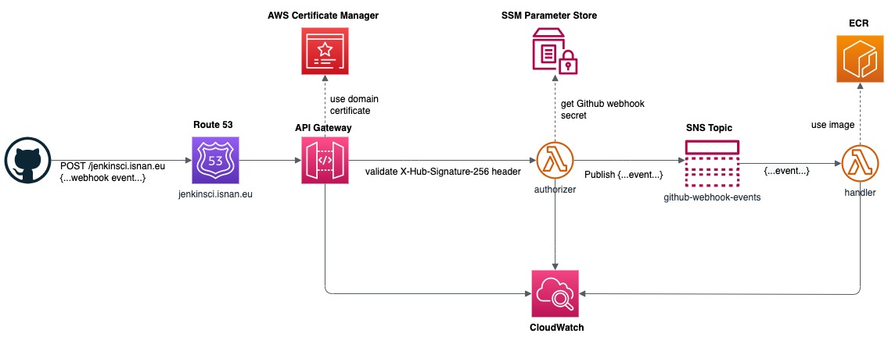

# Jenkins Lambda

An AWS Lambda based project to run Jenkins pipelines triggered bu Github webhooks.
This project relies on the serverless framework (https://www.serverless.com/framework/docs) for AWS Lambda functions deployment and CloudFormation for AWS assets provisioning.

**Warning** It is not a full-fledge Jenkins server, the lambda function contains only the Jenkinsfile runner component.

**Warning** This project cannot be deployed and executed as-is. You have to make adjustems, according to your environment and your needs.

## Architecture



This project consists mainly of 2 lambda functions:

- _authorizer_: Validates the incoming request from GitHub, based on the webhook secret. It is a regular lambda, sitting behind AWS API Gateway, running within an AWS Golang runtime.
- _handler_: The main processor running the Jenkinsfile. This function is based on a custom Docker, which include a Java runtime, for Jenkins file runner and other development tools such as Golang, NodeJS, git, etc ... Feel free to add more tools.

The Github webhook endpoint is exposed through an API Gateway endpoint. The event is processed by the authorizer function which validates the request. Once the validation is successful, the event is published into an SNS topic, and consumed by the handler function. In addition, a Route 53 record points to an API Gateway endpoint, hence providing a user-friendly URL.

### Design choices

- Running the Jenkinsfile is an asynchroneous process in order to workaround API Gateway timeout.

- Currently, it is not possible to rely on a custom authorizer and wire directly the API Gateway to the SNS topic, as the Github paylod validation is based on a signature scheme, and the custom authorizer does not receive the request payload.

### Limitations

- 15 minutes execution time
- git clone and generated artifacts must fit in the 500MB provided (UPDATE : https://aws.amazon.com/blogs/aws/aws-lambda-now-supports-up-to-10-gb-ephemeral-storage/)
- In the Jenkinsfile, the _agent_ must be declared with _any_, eg:

```javascript
pipeline {
    agent any
    // ...
    stages {
       // ...
    }
}
```

## Prerequisites

### 1. Docker image registry

Create the ECR repository to host the handler Docker image.

```shell
aws ecr create-repository --repository-name jenkins-lambda/handler --tags Key=application,Value=jenkins-lambda
aws ecr put-lifecycle-policy --repository-name jenkins-lambda/handler --lifecycle-policy-text "file://functions/handler/ecr-lifecycle-policy.json"
```

### 2. Gihub webhook secret

see: https://docs.github.com/en/webhooks/using-webhooks/validating-webhook-deliveries

Store the Github webhook secret into SSM Parameter Store

```shell
aws ssm put-parameter --name github.webhook.secret --value dummysecret
```

## Resources

- https://github.com/carlossg/jenkinsfile-runner-lambda
- https://github.com/jenkinsci/jenkinsfile-runner
